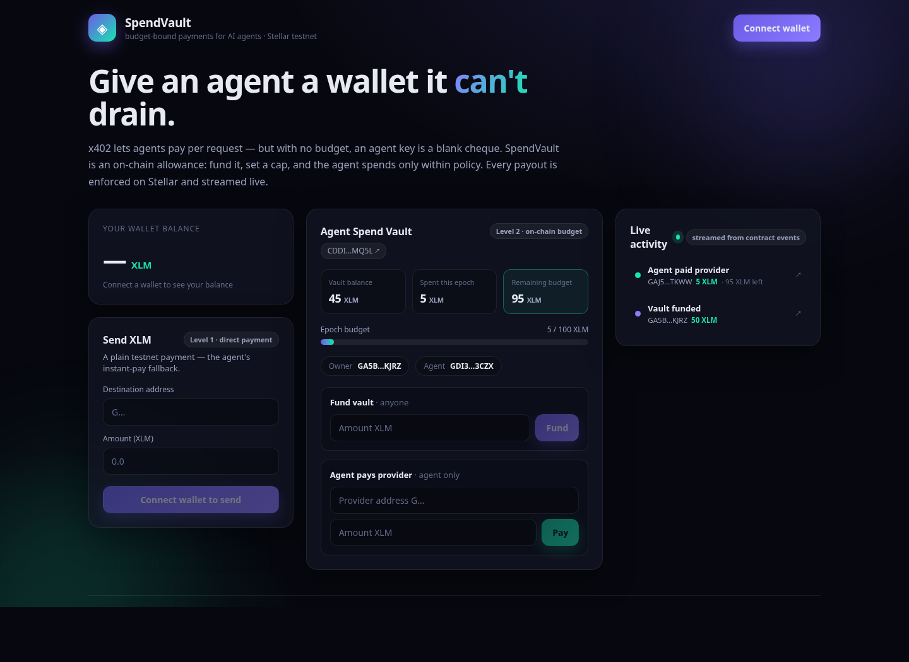
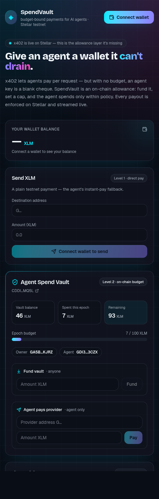

# SpendVault — a budget-enforced spending account for AI agents on Stellar

> Give an autonomous agent a wallet it **can't** drain. SpendVault is an on-chain
> allowance account: the owner funds it and sets a policy (cap per epoch + per-provider
> limits); the agent may only spend **within** that policy. Every payout is an
> inter-contract token transfer that emits an event, streamed live in the UI.

Built for the **Stellar Journey to Mastery** monthly builder challenge (White → Orange belt).

---

## Why this exists

[x402](https://developers.stellar.org/docs/build/agentic-payments/x402) — the agentic
payment protocol now live on Stellar — lets an agent pay per HTTP request via Soroban
authorization. It's stateless: there is no concept of a **budget**, an **allowance**, or a
**spending limit**. Hand an agent a raw key and it can spend everything.

SpendVault adds the missing primitive: **bounded autonomy**.

| Role | Can do |
|------|--------|
| `owner` | fund the vault, set the per-epoch cap, set per-provider limits, rotate the agent key, withdraw |
| `agent` | call `pay(provider, amount)` — and only within policy |

When the agent tries to overspend, the contract rejects it (`BudgetExceeded` /
`ProviderLimitExceeded`). The owner's funds are safe by construction.

---

## Architecture

```
┌────────────┐   fund / set policy    ┌─────────────────┐   transfer (inter-contract)   ┌──────────────┐
│   Owner    │ ─────────────────────▶ │                 │ ────────────────────────────▶ │  Provider    │
│  (wallet)  │                        │   SpendVault    │                               │  (payee)     │
└────────────┘                        │  (Soroban)      │                               └──────────────┘
┌────────────┐   pay(provider,amt)    │                 │        emits Paid event
│   Agent    │ ─────────────────────▶ │  budget checks  │ ──────────────┐
│  (key)     │                        └─────────────────┘               ▼
└────────────┘                                                    ┌──────────────┐
                                                                  │  Live feed   │
                                                                  │  (frontend)  │
                                                                  └──────────────┘
```

- **Contract:** `contracts/spend-vault` (Rust / Soroban). Epoch-windowed budgeting,
  per-provider limits, events on every state change.
- **Frontend:** `web` (Vite + React + TypeScript). Freighter + StellarWalletsKit,
  balance display, plain XLM send, vault funding, agent payments, and a live event feed.

### Contract interface

| fn | who | effect |
|----|-----|--------|
| `init(owner, agent, token, cap_per_epoch, epoch_len)` | owner | one-time setup |
| `deposit(from, amount)` | anyone | top up the vault |
| `set_policy(cap_per_epoch, epoch_len)` | owner | update budget |
| `set_provider_limit(provider, limit)` | owner | per-provider cap |
| `set_agent(agent)` | owner | rotate spender key |
| `pay(provider, amount) -> remaining` | agent | spend within policy |
| `withdraw(to, amount)` | owner | reclaim funds |
| views | — | `get_owner/agent/cap/epoch_len/spent/remaining/balance` |

Errors: `NotInitialized`, `AlreadyInitialized`, `NotAuthorized`, `BudgetExceeded`,
`ProviderLimitExceeded`, `InsufficientBalance`, `InvalidAmount`.

---

## Deployed (Stellar Testnet)

| What | Address / hash |
|------|----------------|
| **SpendVault contract** | [`CDDIK44X…MQ5L`](https://stellar.expert/explorer/testnet/contract/CDDIK44X6QKACSGXJ37LKNLTOA3FAFYWMNICUP6MGVWRWHU7ZC4FMQ5L) |
| **VaultFactory contract** | [`CDWT4DES…J7S2`](https://stellar.expert/explorer/testnet/contract/CDWT4DEST6EIEDDOBGJUCMOVKFEW5R5ACSVVIQZZYOLSREVY5SZKJ7S2) |
| **Token (native XLM SAC)** | `CDLZFC3SYJYDZT7K67VZ75HPJVIEUVNIXF47ZG2FB2RMQQVU2HHGCYSC` |
| SpendVault wasm hash | `3108e0d30fb237d57a089f0ad46e6e97062ba7c1ec6f32a3caf8f2ec64fdff9d` |

**Transaction hashes (verifiable on Stellar Explorer):**

| Action | Tx |
|--------|----|
| Deploy SpendVault | [`e8f89957…668930`](https://stellar.expert/explorer/testnet/tx/e8f89957a31d469c11062ec0161dbff50c49bcff8ecd48e4ae52ad55ef668930) |
| Init SpendVault | [`d5e96591…5da98c`](https://stellar.expert/explorer/testnet/tx/d5e96591efc00472cda8556e2ea89cf7f5dec72dddf25c88ce445ae0375da98c) |
| Deposit (fund vault) | [`c553d777…691df`](https://stellar.expert/explorer/testnet/tx/c553d777cb50dc887164daad70577798d618d405c2dcc7a46d8c66e7a6f691df) |
| **Agent `pay` (contract call)** | [`a861ea73…ec7ad`](https://stellar.expert/explorer/testnet/tx/a861ea73a93c59ec3e634794cf1a6cb9258fa2fe1bdf12abb4088b7aef5ec7ad) |
| Init VaultFactory | [`a02f54d9…a1c27`](https://stellar.expert/explorer/testnet/tx/a02f54d9965e91be2600fd2a109fd39c3a664e51e40fa60e889db5adacfa1c27) |
| **`create_vault` (deploy+init child)** | [`f9c07c17…4a63f`](https://stellar.expert/explorer/testnet/tx/f9c07c178e9a54d221719eeac8e3ad385d8b2273eaa796a7b532846c0df4a63f) |

> The `pay` tx emits a `transfer` event (vault → provider — an inter-contract SAC call) and a
> `paid` event `[amount, remaining_budget, epoch]`, streamed live in the UI. `create_vault`
> deploys **and** initializes a child SpendVault in a single transaction (two inter-contract ops).

---

## Run locally

### Prerequisites
- Rust + `wasm32v1-none` target, [`stellar-cli`](https://developers.stellar.org/docs/tools/cli)
- Node 20+ and `pnpm`
- [Freighter](https://www.freighter.app/) browser extension, set to **Testnet**

### Contract
```bash
cd contracts/spend-vault
stellar contract build
cargo test
```

### Deploy to testnet
```bash
stellar keys generate --global deployer --network testnet --fund
stellar contract deploy --wasm target/wasm32v1-none/release/spend_vault.wasm \
  --source deployer --network testnet
```

### Frontend
```bash
cd web
cp .env.example .env   # set VITE_CONTRACT_ID etc.
pnpm install
pnpm dev
```

---

## Screenshots

**Desktop — live vault state + streamed event feed**



**Mobile responsive**



<!-- Capture with Freighter connected for the White-belt checklist: -->
- Wallet connected state — _add screenshot with Freighter connected_
- Successful testnet transaction + result toast — _add screenshot after sending XLM / funding the vault_

## Demo video

<!-- Level 3: 1–2 min walkthrough -->
`Add link (Loom / YouTube unlisted)`

---

## How it relates to x402

[x402](https://developers.stellar.org/docs/build/agentic-payments/x402) is now live on Stellar
(testnet + mainnet): an agent signs a Soroban authorization to pay per HTTP request, settled in
~5s for ~$0.00001. It is intentionally **stateless** — there is no budget or allowance layer.
SpendVault is the complementary primitive: the agent's funds live in the vault, and an x402
payment becomes a `pay(provider, amount)` call that the contract only honors **within policy**.
The roadmap below wires the vault behind an x402 facilitator so the spend cap is enforced on
every per-request payment.

## Tech

- **Contracts:** Rust / Soroban (`soroban-sdk 25`), 8 unit tests, epoch-windowed budgeting.
- **Frontend:** Vite + React + TypeScript, `@stellar/stellar-sdk`, StellarWalletsKit.
- **CI:** GitHub Actions — contract tests + wasm build + frontend typecheck/build (`.github/workflows/ci.yml`).

## Belt coverage

| Belt | Requirement | Where |
|------|-------------|-------|
| White | Freighter connect/disconnect | `web/src/components/WalletButton.tsx` |
| White | XLM balance displayed | `web/src/components/BalanceCard.tsx` |
| White | Send XLM on testnet + tx feedback | `web/src/components/SendXlmCard.tsx`, `lib/stellar.ts` |
| Yellow | StellarWalletsKit multi-wallet | `web/src/lib/wallet.ts` |
| Yellow | Deployed contract called from frontend | `web/src/lib/contract.ts` (deposit/pay) |
| Yellow | Real-time events / status | `web/src/components/ActivityFeed.tsx`, toasts |
| Yellow | 3+ error types handled | `web/src/lib/errors.ts` |
| Orange | Advanced contract + inter-contract | `pay` → SAC, `VaultFactory.create_vault` |
| Orange | Tests | `contracts/spend-vault/src/test.rs` (8 passing) |
| Orange | CI/CD | `.github/workflows/ci.yml` |
| Orange | Mobile responsive | `docs/mobile.png` |

## Run the deployment workflow

```bash
./scripts/deploy.sh   # build, fund a key, deploy SpendVault + VaultFactory, init, demo a pay
```

## License
MIT
